# EventPulse 360: Smart Event & Hackathon Management Platform

> **A Unified, Real-Time Platform for Hackathons, Tech Fests, and Conferences.**  
> Built for the Prompt War 2026 Challenge.

---

## 🌟 1. Executive Summary & Problem Solved

### The Problem
Organizing large-scale tech events currently requires juggling **5–6 disconnected tools**:
- **Registration**: Google Forms / Typeform
- **Attendee Check-in**: Separate scanner apps or paper lists
- **Team Formation**: WhatsApp / Discord chaos
- **Announcements**: Telegram / WhatsApp broadcasts
- **Judging & Evaluation**: Excel sheets / Devpost
- **Leaderboard & Analytics**: Manual calculations & static tables

This fragmentation causes delays, double check-ins, delayed score tallies, and frustration for organizers, participants, and judges.

### The Solution: EventPulse 360
EventPulse 360 consolidates the entire event lifecycle into a **single, interactive, real-time platform** powered by **Supabase PostgreSQL** and **React 19**:
1. **Participant Hub**: Instant 1-click registration, digital QR ticket badge generator, smart team matchmaker with skill filtering, project submission portal, and live timeline.
2. **Organizer Command Center**: Camera QR scanner with sub-100ms verification, rapid manual barcode entry, live check-in velocity graphs, real-time push broadcast center with audio alerts, and 1-click CSV export.
3. **Judge Evaluation Portal**: PIN-protected judge dashboard, 5-axis weighted rubric sliders (Innovation, Technical Execution, UI/UX, Presentation, Market Impact), structured feedback notes, and tamper-proof evaluation locking.
4. **Live Stage Arena & Leaderboard**: Animated top-3 podium (Gold/Silver/Bronze) with particle confetti celebrations, track filters, and real-time score recalculation via WebSockets.

---

## 🏗️ 2. Multi-Role Architecture & UX Flow

```mermaid
graph TD
    A[EventPulse 360 Platform] --> B[Interactive Role Switcher]
    
    B --> C[Participant Hub]
    C --> C1[1-Click Registration]
    C --> C2[Dynamic QR Ticket Pass]
    C --> C3[Smart Team Matchmaker]
    C --> C4[Project Submission Portal]
    C --> C5[Live Event Timeline]

    B --> D[Organizer Desk]
    D --> D1[Camera QR Scanner]
    D --> D2[Manual Barcode Search]
    D --> D3[Broadcast & Audio Alerts]
    D --> D4[Live Analytics & Charts]
    D --> D5[Attendee Roster & CSV Export]
    D --> D6[Rubric Matrix Config]

    B --> E[Judge Portal]
    E --> E1[PIN-Protected Login]
    E --> E2[Submissions Review Queue]
    E --> E3[5-Axis Weighted Rubric Sliders]
    E --> E4[Constructive Feedback Notes]
    E --> E5[Score Locking Engine]

    B --> F[Live Arena Leaderboard]
    F --> F1[Top-3 Animated Podium]
    F --> F2[Track-based Filter Table]
    F --> F3[Live WebSocket Recalculation]
    F --> F4[Confetti Celebration Burst]
```



---

## 🗄️ 3. Database Schema (Supabase PostgreSQL)

The platform is backed by a relational PostgreSQL database on **Supabase** with Row-Level Security (RLS) and Realtime WebSocket replication:

| Table | Purpose | Key Attributes |
| :--- | :--- | :--- |
| `events` | Global event configuration & tracks | `id`, `title`, `tracks (JSONB)`, `rubrics (JSONB)`, `start_date`, `end_date` |
| `participants` | Attendee profiles & check-in state | `id`, `name`, `email`, `role`, `skills (JSONB)`, `qr_ticket_id`, `is_checked_in`, `checked_in_at`, `team_id` |
| `teams` | Formed squads & recruitment needs | `id`, `name`, `track`, `description`, `needed_roles (JSONB)`, `is_open` |
| `submissions` | Final hackathon projects | `id`, `team_id`, `title`, `tagline`, `description`, `track`, `repo_url`, `live_demo_url`, `video_url`, `deck_url` |
| `judges` | Registered event evaluators | `id`, `name`, `email`, `designation`, `avatar_url`, `access_pin` |
| `evaluations` | Weighted rubric scorecards | `id`, `submission_id`, `judge_id`, `criteria_scores (JSONB)`, `total_score`, `feedback`, `is_locked` |
| `announcements` | Real-time broadcast alerts | `id`, `title`, `message`, `category ('urgent'\|'schedule'\|'food'\|'workshop')`, `is_pinned` |

---

## 🛡️ 4. Security & Data Integrity Guarantees

1. **Unique Collision-Proof QR Tokens**:
   - Each participant is assigned a unique cryptographic ticket code (`EP360-TKT-XXXXXX`).
   - The scanner checks state in Supabase and blocks duplicate entries with exact timestamp tracking.
2. **Judge Authentication & Authorization**:
   - Dedicated access PIN verification for judges to prevent unauthorized tampering with evaluations.
3. **Immutable Score Locks**:
   - Once a scorecard is locked, composite unique constraints on `(submission_id, judge_id)` prevent duplicate or corrupted scorecards.
4. **Sanitized Links & XSS Prevention**:
   - All submitted GitHub repos, live demos, and video links are sanitized and strictly validated.
5. **Row Level Security (RLS)**:
   - Supabase RLS policies are enabled across all tables ensuring access governance.

---

## ⚡ 5. Real-Time Synchronization Engine

- **Supabase Realtime Channels (WebSockets)**:
  - When an organizer broadcasts an announcement, all connected participants and judges receive instant toast alerts and audio chimes.
  - When a judge submits or edits a score, the Live Leaderboard updates immediately without requiring a manual page refresh.
  - When an attendee checks in via camera or manual search, the organizer velocity analytics chart updates dynamically.

---

## 🚀 6. How to Run Locally

### Prerequisites:
- Node.js (v18+)
- npm / yarn / pnpm

### Quick Start:
```bash
# 1. Install dependencies
npm install

# 2. Run local development server
npm run dev

# 3. Build production bundle
npm run build
```

---

## 🎯 7. Judge Q&A Quick Reference

### Q1: What makes this solution stand out from existing tools like Devpost or Eventbrite?
**Answer:** Devpost handles only submissions, and Eventbrite handles only tickets. EventPulse 360 unifies the entire lifecycle (Registration → QR Check-in → Team Matchmaking → Emergency Broadcasts → Rubric Judging → Live Leaderboard) into one real-time dashboard.

### Q2: How does the system handle high-volume check-ins during morning rush?
**Answer:** The QR check-in terminal performs verification in under 100 milliseconds via camera or barcode search. It provides instant visual + audio confirmation and records timestamped entry logs.

### Q3: What if internet connection fluctuates during the event?
**Answer:** The architecture features reactive state resilience with Web Audio and cached local persistence, gracefully resynchronizing with Supabase as soon as connection is restored.
